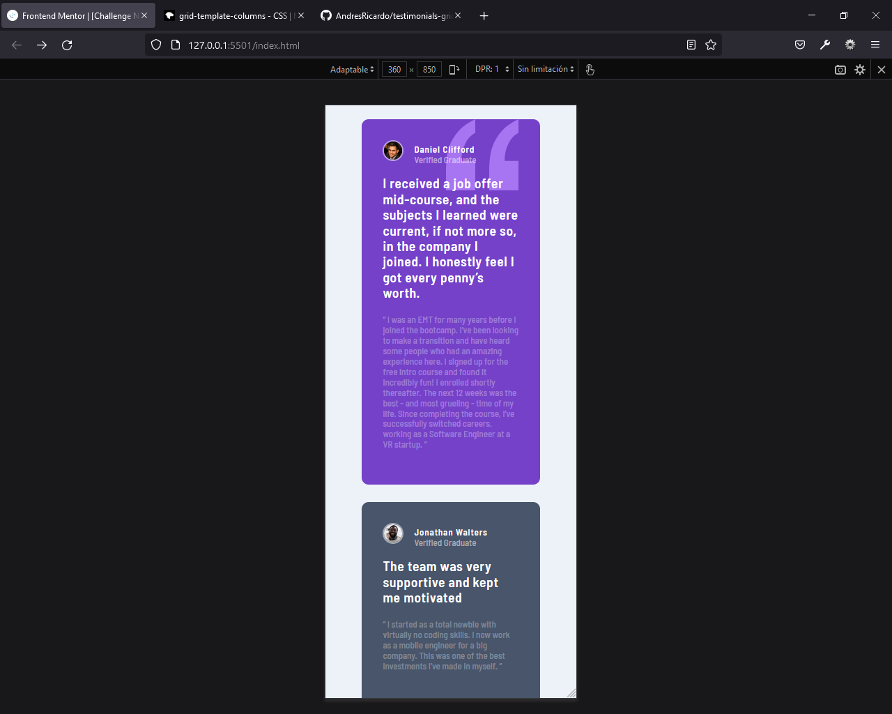
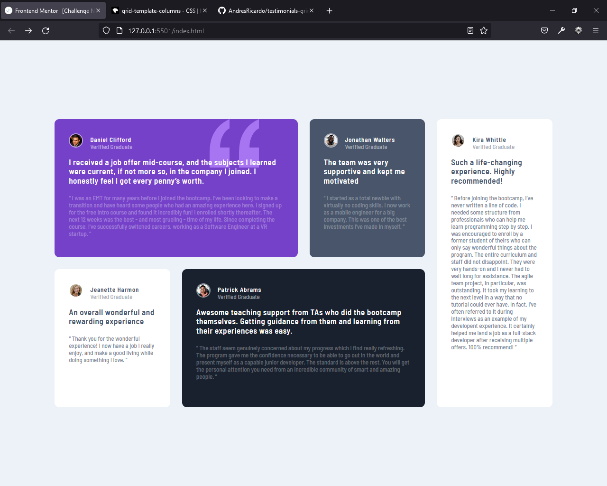

# Frontend Mentor - Testimonials grid section solution

This is a solution to the [Testimonials grid section challenge on Frontend Mentor](https://www.frontendmentor.io/challenges/testimonials-grid-section-Nnw6J7Un7). Frontend Mentor challenges help you improve your coding skills by building realistic projects.

## Table of contents

-   [Overview](#overview)
    -   [The challenge](#the-challenge)
    -   [Screenshot](#screenshot)
    -   [Links](#links)
-   [My process](#my-process)
    -   [Built with](#built-with)
    -   [What I learned](#what-i-learned)
    -   [Continued development](#continued-development)
    -   [Useful resources](#useful-resources)
-   [Author](#author)
-   [Acknowledgments](#acknowledgments)

**Note: Delete this note and update the table of contents based on what sections you keep.**

## Overview

This challenge was made using just HTML and CSS (SASS, Flexbox, CSS Grid), but thinking in desktop first.

### The challenge

Users should be able to:

-   View the optimal layout for the site depending on their device's screen size

### Screenshot





### Links

-   Solution URL: [Github repository](https://github.com/AndresRicardo/testimonials-grid-section-main)
-   Live Site URL: [Github page](https://andresricardo.github.io/testimonials-grid-section-main/)

## My process

Until now i am just learning web development, by now i just know html and css, sass, not css frameworks, not css post-processores, not Javascript, not Js frameworks.

### Built with

-   Semantic HTML5 markup
-   CSS custom properties
-   Flexbox
-   Css grid
-   Css pre-processor sass
-   Desktop-first workflow

### What I learned

doing this challenge i learned basics use of css grid (grid-template-colums, grid-template-rows, grid-colum grid-row, repeat(), minman(), fr, gap, column-gap, row-gap, span), I also learned the basic syntax of sass, using inheritance and variables.

```css
.card-header {
    display: grid;
    grid-template-rows: 15px 15px;
    grid-template-columns: 30px 1fr;
    column-gap: 15px;
    margin-bottom: 20px;

    .header-image {
        grid-row: 1 / span 2;
        border-radius: 50px;
        border: 2px solid rgba($color: $color-White, $alpha: 0.5);

        img {
            width: 100%;
            border-radius: 50px;
            border-color: white;
        }
    }
    .card-name {
        font-weight: 600;
        letter-spacing: 0.07rem;
        line-height: 0px;
    }
}

#daniel {
    grid-row: 1 / span 1;
    grid-column: 1 / span 2;

    background-image: url(images/bg-pattern-quotation.svg);
    background-repeat: no-repeat;
    background-position: 80% 0%;
}
```

### Continued development

Even if to me is more complex design mobile first, i preffer to continue develop of this way.
By now in short time, my next skills to develop are css grid, css frameworks (boostrap or tailwind), css pre-preocessor (sass), css post-processors (postcss), pure Javascript, typescript and css-framework (angular).

### Useful resources

-   [Developer mozilla](https://developer.mozilla.org/es/docs/Web/CSS/) - This helped me like general reference.

## Author

-   Website - [Richi](https://github.com/AndresRicardo)
-   Frontend Mentor - [@AndresRicardo](https://www.frontendmentor.io/profile/AndresRicardo)

## Acknowledgments

To my mom and dad jajajajja.
